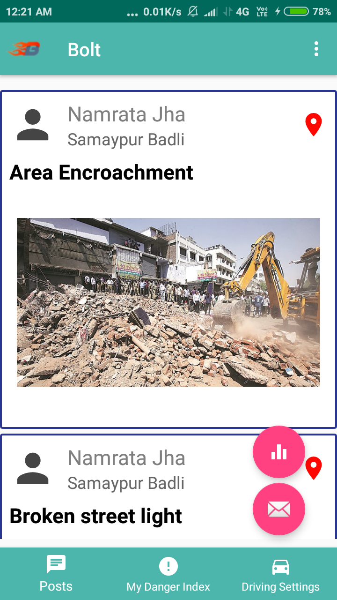
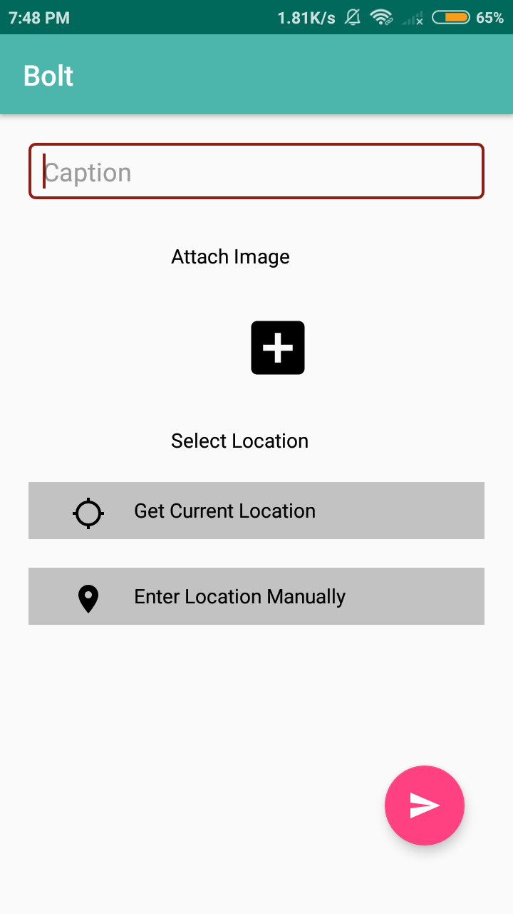
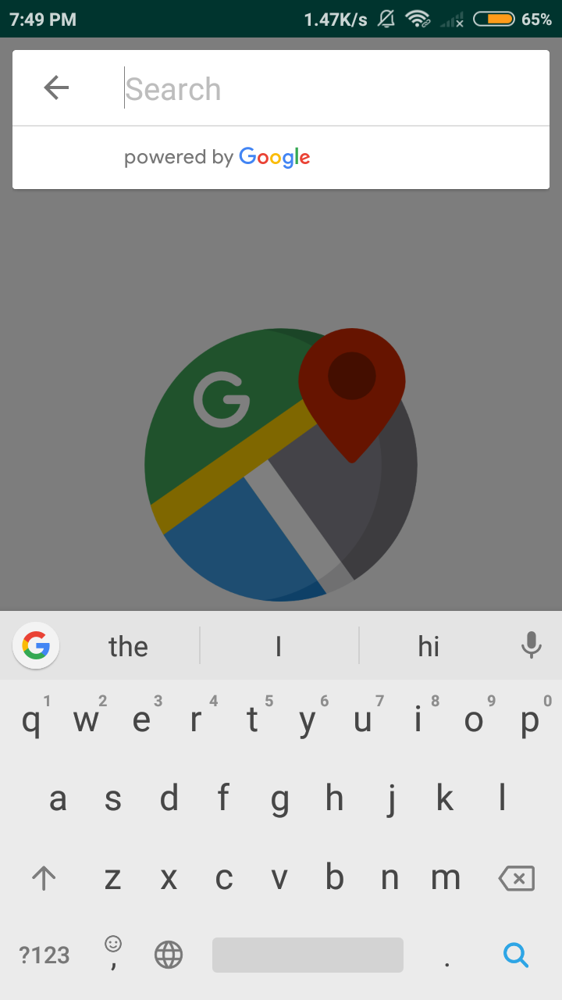
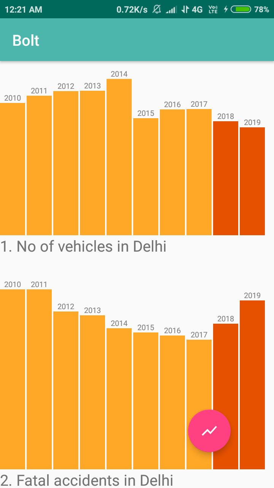
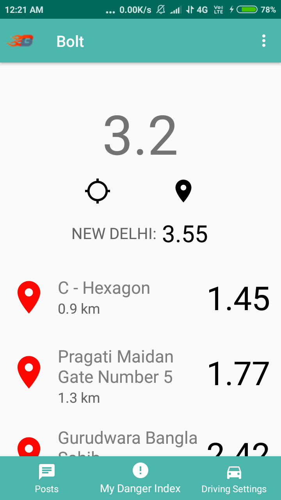
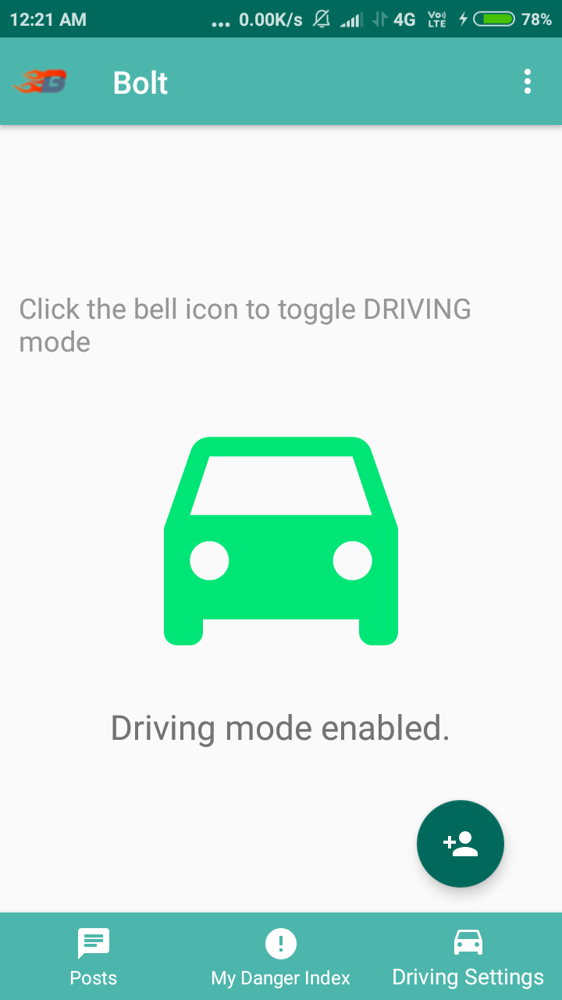
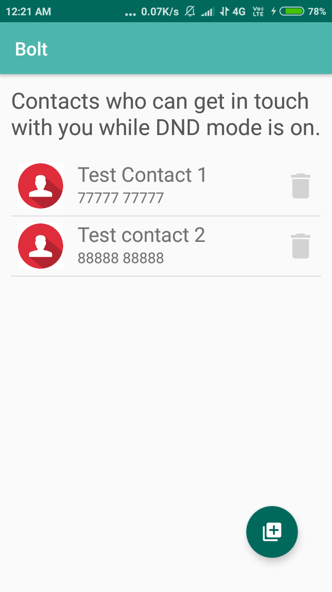

# hackCBS
An Android application to predict the danger index of the roads of any locality in Delhi, based upon the data provided by the Delhi Traffic Police. Moreover, it lets the user add geo-tagged posts about the lack of infrastructure to be highlighted to the concerned authorities. The app also provides a driving mode option, which when turned on blocks all unimportant calls while you're driving, and notifies them when you've reached. 

Displaying the geo-tagged posts added by various users.
 

 

Creating a new post.
 

 

Adding a location different from the user's current location to geo-tag the post.
 

 

Graphs Predicting the trends for various parameters in the upcoming years.
 

 

Prediction of the danger index of the roads of any locality in Delhi.
 

 

Driving mode button to prevent road accidents while taking calls while driving.
 

 

Entering important contacts whose calls are not to be blocked while driving.
 

